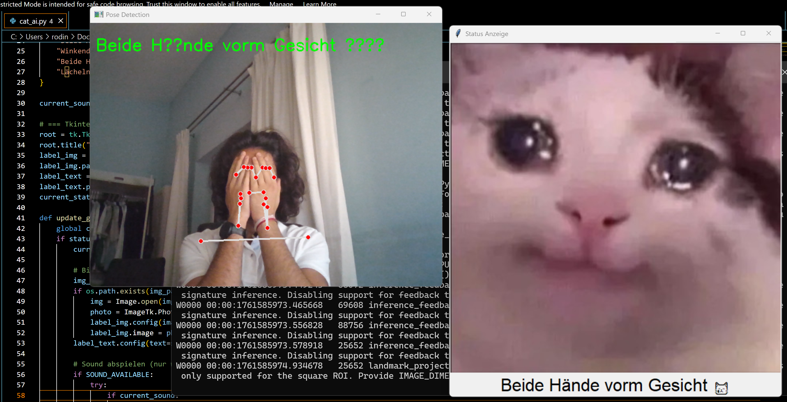

# Cat AI 😸

Your webcam reacts to your face and hand gestures, showing matching cat images and playing sounds.

## Pose recognition

| Emote       | Description            | Img                                     |
|-------------|-----------------------|----------------------------------------|
| Normal      | Keine Bewegung         |  |
| Laughing 😸 | Lächeln                |  |
| Crying 😿   | Beide Hände vorm Gesicht |  |
| One hand ✋  | Winkende Hand          |  |
| Both 🙌     | Beide Hände oben       |  |

## Functions

- **Pose & Gesture Recognition:**  
  - Both hands up 🙌  
  - One hand waving ✋  
  - Hands covering face 😿  
- **Face Expression Detection:**  
  - Smile 😸  
- **Real-time:** Live webcam feed  
- **Optional Sound:** Plays corresponding sound files  
- **Interactive GUI:** Shows images based on detected status  

