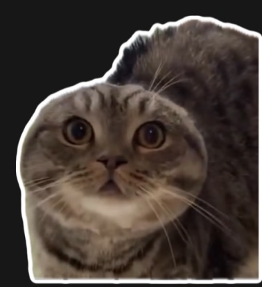
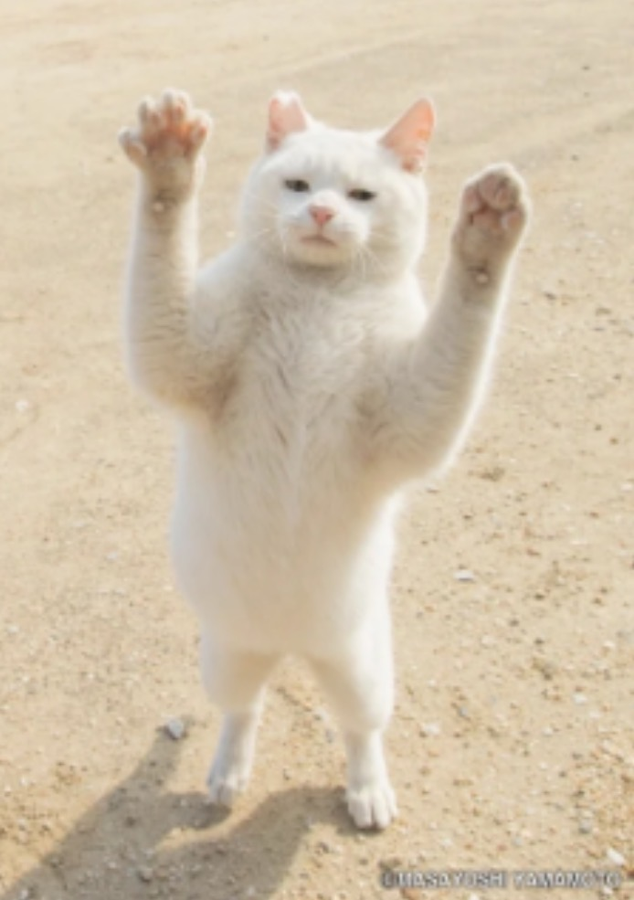

# Cat AI 😸

Your webcam reacts to your face and hand gestures, showing matching cat images and playing sounds.

## Pose recognition

| Emote       | Description            | Img                                     |
|-------------|-----------------------|----------------------------------------|
| Normal      | Keine Bewegung         |  |
| Laughing 😸 | Lächeln                |  |
| Crying 😿   | Beide Hände vorm Gesicht |  |
| One hand ✋  | Winkende Hand          |  |
| Both 🙌     | Beide Hände oben       |  |

## Functions

- Full-body pose detection (33 landmarks)  
- Face detection (468 landmarks)  
- Left and right hand detection (21 landmarks each)  
- Gesture recognition: both hands up 🙌, one hand waving ✋, hands covering face 😿  
- Smile detection 😸  
- Real-time GUI updates with cat images  
- Optional sound feedback for each status

